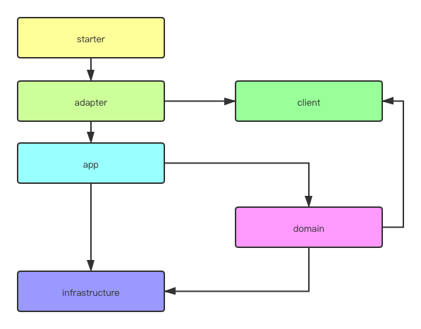

# DDD Sample java

大力借鉴了 [alibaba cola](https://github.com/alibaba/COLA) 的思想，在此致以感谢。

## 总体思路
* 面向离职编程（方便他人参与，方便他人接手）：DDD
* 方便大团队开发：分包限定ioc，例如基建层必须实现领域防腐层，领域层仅需内部调用；parent pom放弃灵活性，限定包及版本
* 简单：方便不同层次开发者；去除一些复杂的概念

## 设计：
1. 分包  
分包实际上降低了开发效率。在大团队开发中，最需要保证的是效率下限不至于太低，因为调用关系的确定，分包能够确保每个人的边界清晰。
如果是小团队或个人开发，在常见的微服务体系中，本质上没有分包的必要。
1. tdd  
传统service+dao的体系中，tdd不影响业务开发，推行tdd非常困难。  
ddd的开发中，领域是最先开始开发的，没有单元测试无法调试领域内容，确保单元测试是有真实场景的。
1. domain层耦合存储操作  
domain层应该完全框架无关。  
有一种做法是使用app层控制存储层写入，做到完全框架无关，这样开发成本和认知成本会高一点。  
所以目前没有完全解耦存储，还是加入了存储bean的获取，降低开发和认知成本，尽量保持ioc。
1. 初始化及版本间升级脚本
放在docs/migrations中，包含sql和其他升级脚本，每个版本一个文件夹

## 与cola的不同：
1. controller放在了adapter内，加入了其他入口形式，统一了整个入口
1. cola在app层内分文件放置了事件风暴，这样结构更清晰，如果团队ddd比较成熟可以这样做。目前把事件统一在一个文件中，减少认知负担。
1. 领域概念标识并区分了文件夹，方便团队熟悉DDD。
1. 额外增加了testing层，为了能顺利启动各层单元测试，提高单元测试代码覆盖率

## 分层介绍：

1. starter  
项目启动类，只能依赖入口adapter
代码虽然没有几行，所有的配置都在这里
1. testing  
单元测试启动包，所有的单元测试需要依赖  
启动类和相关的配置在这里  
1. client  
    域内服务接口，对外暴漏领域能力，供app层调用域内服务  
    不依赖任何服务  
    * 常见的请求dto及输出dto，因为dto太过于通用，这里换成requestobject=RO，clientobject=CO  
    * 所有枚举包括异常枚举  
1. adapter：入口  
所有对内调用在一个入口，调用各种外部对象在一个出口，即是高内聚六边形架构。  
所以常见的调用方法-controller、mq、定时任务或命令行传参-都作为入口调用方放在adapter。  
只能依赖app层，被starter依赖  
1. app：命令  
按照cqrs原则分为command和query  
command即是事件风暴中的事件  
query即是事件风暴中的读模型  
只能依赖client及infrastructure，方便query直接查询  
1. domain  
    本层只能依赖client  
    - 领域层，按不同领域分开  
    - 域内服务：实现了client中的接口，供外部调用  
    
    ---如果不熟悉ddd，可以从这里开始使用传统service的写法---  
    
    - 聚合根：领域主入口，也是一个实体
    - 实体：领域里的其他实体
    - 值对象：属性
    - 防腐层：这里缩减了防腐层及删除了repo，原因是当今微服务盛行，单个应用体积都不算太大，这里大多数内容都已经沉降在infrastructure中。这里只做接口
    - 事件：事件对象
    
    ---DDD和service究竟有什么样本质上的不同---  
    
    假如在一个service中吸收ddd的思想，也做好防腐层、事件驱动这些，是不是比DDD更优秀？（假DDD都是这么做的）  
    service有一些方面永远比不上DDD：
    * 没有固定的逻辑来区分对象，团队开发每个人写法都不同，接手困难
    * 复杂逻辑只能写在一起。在ddd中，每个对象相关逻辑是分布在每个对象的代码中的
    * 面向过程。面向对象的发明本来就是要解决复杂逻辑的问题，service只写逻辑，完全没有应用到面向对象的优势。

1. infrastructure  
基建：数据库及各种外部rpc，使用gateway作为入口  
其他：配置、common包等  
只能依赖domain  

## 不足：
domain需要使用ApplicationContext来获取bean，不是非常优雅